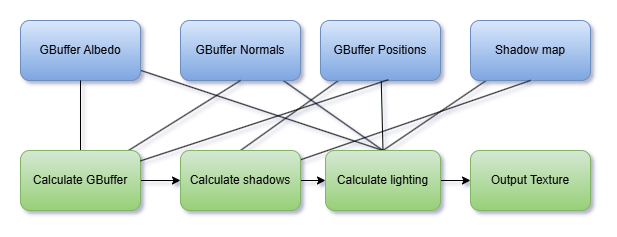
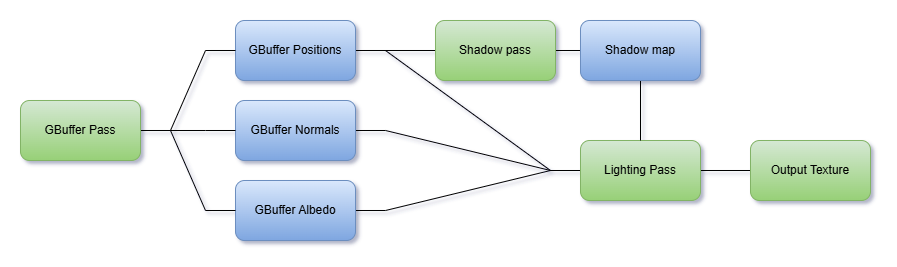

# Introduction
Rendering systems with high complexity are hard to manage, which leads to bugs and unreadable code. That's why we have Rendergraphs to mitigate this issue, along with other optimizations that the use of a Rendergraph will bring to you if used in your rendering pipeline. In this blog I will be explaining how I designed and implemented a simple Rendergraph system into my DirectX 12 renderer called [Butterfly](https://google.com). This blog will be more focused on implementation details and roadblocks I hit along the way, reason being that I noticed many articles about this topic are often highlighting high level concepts instead of implementation details and code design. For this reason, I chose to write this blog like this.

# What is a Rendergraph?
Rendergraphs aim to divide complex rendering work in to so-called "Passes". Every pass contains a "step" in the rendering pipeline. For example, writing to a GBuffer as pass 1. And calculating lighting using said GBuffer would be pass 2. By designing a system that allows easy sharing of dependencies (Pass 2 depends on Pass 1's work) we allow every pass to consist of a set of Inputs and Outputs. This makes it so every pass has their own set of data to work with, rather than data being all over the place.

This is what a typical render pipeline would look like if all the dependencies are managed in one system.


By using a Rendergraph we define in and outputs for these render tasks and the pipeline becomes way cleaner.


### Optimization benefits.
Because we divide the work into passes we have more control over when the gpu needs to be synced. These operations can be expensive and hard to manage in a complex rendering pipeline. By recording dependencies we know exactly which passes have dependencies and do gpu syncs accordingly, this also means the user does not have to worry about manually synchronizing anymore.

# What ingredients do we need.
To design a Rendergraph system we need a few things:
* A way to record any dependencies.
* A way to define a pass's execution and sort based off of the pass's dependencies.
* A way to create and manage temporary resources used only in the Rendergraph.
* A way to handle external dependencies.


### A render pass in my Rendergraph.
This is what a pass in my Rendergraph looks like. I will be explaining how it works.
```cpp
struct GBufferLight
{
	BFRGTexture* PositionTexture;
	BFRGTexture* NormalTexture;
	BFRGTexture* DepthStencil;
	BFRGTexture* AlbedoTexture;
	BFRGTexture* OutputTexture;
};

GBufferLight* params = builder.AllocParameters<GBufferLight>();

params->PositionTexture = builder.GetPassData<GBufferLight, GBufferPostiion>();
// etc.

builder.AddPass<GBufferLight>("Composite pass",
	[&](const GBufferLight& params, DX12CommandList& list)
	{
		// Lambda representing render commands.
	});
}
```

## Recording dependencies.
Because we want to work with outputs from other passes, we need to set up a system that records dependencies. I have chosen to do this with the builder-pattern. In the previous code snippet you can see I called ``builder.AllocParameters<T>``, this is from the GraphBuilder class and it will signal to the the GraphBuilder to add a new pass using GBufferLight as the type/identifier. When ``builder.AllocParameters<T>()`` is called you will be able to call ``builder.GetPassData<GBufferLight,OtherPass>()``, This will return a pointer to the data that was allocated using ``builder.AllocParameters<T>();`` by other passes.

#### More in depth.
AllocParameters will take the template type and make it inherit from ``PassBase`` this will turn it in to a class of type ``Pass<GBufferLight> : public PassBase`` internally. Shown in the code snippet is the implementation of the AllocParameters function and how converting the GBufferLight struct in to a ``Pass<GBufferLight>.`` that inherits from PassBase.

```cpp
template<typename ParamStruct>
inline ParamStruct* GraphBuilder::AllocParameters()
{
	// Allocate a new pass of type Pass<GBufferLight> in our case.
	auto* pass = new Pass<ParamStruct>();

	// Go add the pass to the PassTypes unordered list as an index in to the Passes vector. This way we can acces the pass via the type later.
	m_graph->PassTypes[typeid(ParamStruct)] = static_cast<uint32_t>(m_graph->Passes.size());
	m_graph->Passes.push_back(pass);

	// Return the newly allocated pass parameters.
	return &pass->m_parameters;
}
```

```cpp
template<typename Params>
class Pass : public PassBase
{
public:
	virtual void Execute(DX12CommandList& cmdList) override;

	friend class GraphBuilder;
private:
	std::function<void(const Params&, DX12CommandList&)> m_executeLambda;
	Params m_parameters;
};
```

Now that we can allocate new pass data, we need to be able to fetch it and record a dependency. This is done in the ``GetPassData<ThisPass, OtherPass>()`` function.
```cpp
template<typename PassType, typename ParamStruct>
inline ParamStruct* GraphBuilder::GetPassData() const
{
	// This will fetch the dependencies vector from the Pass<ThisPass>
	auto& depVec = PassFromType<PassType>()->m_dependencies;
	
	// It will look if there is already a dependency inside of the dependency vector of type OtherPass.
	if (std::find(depVec.begin(), depVec.end(), typeid(ParamStruct)) == depVec.end())
	{
		// If not it adds the pass as a dependency to be sorted later.
		depVec.push_back(typeid(ParamStruct));
	}
	
	// It grabs the OtherPass and returns its parameters.
	Pass<ParamStruct>* pass = PassFromType<ParamStruct>();
	return &pass->m_parameters;
}
```
## Pass execution & sorting.
There are several ways we can define a pass's execution. Like using the builder-pattern to append render-commands, overriding virtual functions inside a class that inherits from Pass, or Lambda's. For my Rendergraph I chose to work with Lambda's since it allows for more freedom than using the builder-pattern and less boilerplate than writing custom class implementations for every pass. But we can't just iterate over all the execution lambda's because of the dependencies. This is where the **Compilation/Sorting** of the Rendergraph comes in.

In the GraphBuilder there is a ``Create()`` function that will sort the passes and return an object of type ``Graph`` that is able to be executed by the rendering pipeline.
This is the implementation of the ``Create()`` function:
```cpp
inline const Graph* GraphBuilder::Create()
{
	SortPasses();
	CalculateFencePoints();

	m_hasBeenCreated = true;
	return m_graph;
}
```

Sorting the passes is based on the Topology sort Kahn algorithm and will sort the passes based on their dependencies. This is where we prepare the passes to be sorted.
```cpp
inline void GraphBuilder::SortPasses()
{
	const uint32_t numPasses = static_cast<uint32_t>(m_graph->Passes.size());

	// Prepare for topological sort.
	std::vector<std::vector<int>> passes;
	passes.reserve(numPasses);
	for (int i = 0; i < static_cast<int>(numPasses); i++)
	{
		if (m_graph->Passes[i]->m_dependencies.empty()) continue;
		std::vector<int> deps;
		for (int j = 0; j < m_graph->Passes[i]->m_dependencies.size(); j++)
		{
			passes.push_back({ m_graph->PassTypes[m_graph->Passes[i]->m_dependencies[j]], i });
		}
	}

	// Do topological sort.
	auto sortedIndices = Utils::TopologicalSortKahn(numPasses, passes);

	// Add the sorted passes to the Graph.
	m_graph->SortedPasses.reserve(numPasses);
	for (uint32_t i = 0; i < numPasses; i++)
	{
		m_graph->SortedPasses.push_back(m_graph->Passes[sortedIndices[i]]);
	}
}
```

After this, we calculate the FencePoints. These are the points where gpu syncs have to happen. This is as simple as iterating through the sorted array of passes and looking if it has any dependencies.
```cpp
inline void GraphBuilder::CalculateFencePoints()
{
	// Record fence points;
	const uint32_t numPasses = static_cast<uint32_t>(m_graph->SortedPasses.size());
	for (uint32_t i = 0; i < numPasses; i++)
	{
		if (!m_graph->SortedPasses[i]->m_dependencies.empty())
		{
			m_graph->PassFenceIndices.push_back(i - 1);
		}
	}

	// Add a fence point at the end so the graph since it is always neccesary.
	m_graph->PassFenceIndices.push_back(numPasses - 1);
}
```

We now have a ``Graph`` object that we can call ``Execute()`` on. This will record and execute all the gpu work and add gpu syncs where necessary from the data we gathered.
```cpp
uint32_t j = 0;
for (uint32_t i = 0; i < numPasses; ++i)
{
	DX12CommandList& list = handles[i]->List();
	SortedPasses[i]->Execute(list);

	cmdListQueue.push_back(list.List());

	if (i == PassFenceIndices[j])
	{
		DX12API()->Queue(QueueType::Direct)->Execute(static_cast<uint32_t>(cmdListQueue.size()), cmdListQueue.data());

		// Wait till previous work is executed.transitions.
		DX12API()->Queue(QueueType::Direct)->WaitForFence();

		cmdListQueue.clear();
		j++;
	}
}
```

## Transient resources
We want to be able to create temporary resources used by the Rendergraph. For example, depth buffers for depth testing or a texture to write GBuffer normals to. The lifetimes of these resources should be managed by the Rendergraph itself. However, allocating and deallocating resources every frame is expensive, and we want to avoid doing this. In my implementation I created a separate class called ``GraphTransientResourceCache`` which will cache the resources based on a frame-based lifetime. This is the implementation.

Calling GraphBuilder's ``CreateTransientTexture()`` Will allocate **or** return a resource. If its found in the ``GraphTransientResourceCache``'s cache it will return said resource. If not it will create it. ``CreateTransientTexture()`` will call ``GetOrCreateTexture``.
```cpp
BFRGTexture& GraphTransientResourceCache::GetOrCreateTexture(const BFRGTextureInitializer& initializer)
{
	const std::string& key = initializer.Name;

	auto it = m_resources.find(key);
	if (it == m_resources.end())
	{
		auto* newResource = AllocTexture(initializer);
		return *newResource;
	}

	// Get an existing resource.
	auto* out = reinterpret_cast<BFRGTexture*>(it->second);

	// Reset the resource's lifetime since we referenced it.
	m_lifetimes[key] = GRAPHRESOURCE_LIFETIME;
	return *out;
}

```

After every frame, we need to update every resource's lifetime. This is done by calling ``UpdateLifetimes()`` after the execution of the Rendergraph. If a lifetime hits 0 it will be deallocated.
```cpp
void GraphTransientResourceCache::UpdateLifetimes()
{
	// Caching the resources to delete to not break the for loop iterator.
	std::queue<std::string> toDelete;

	for (auto& lifetime : m_lifetimes)
	{
		lifetime.second--;
	}

	DeallocDeadResources();
}
```


## External Resources
We want to have data to render and other parameters that might impact how a frame is rendered. We can pass these in with the execution lambda's but, this is difficult if the pass lambda implementations are in different locations. For this, we use a system called a **Blackboard**. This will allow you to store and fetch data based on a key. 
We use ``std::any`` to be able to store any type of data we want.

```cpp
class Blackboard
{
public:
    template <typename ResourceType>
    void Register(ResourceType* value, const std::string& key);

    template <typename ResourceType>
    ResourceType& Get(const std::string& key) const;
    
private:
	std::unordered_map<std::string, std::any> m_data;
};

```

When we register a resource we add it to ``m_data`` by using the string as a key, std::any will allow for the ResourceType to be stored.
```cpp
template <typename ResourceType>
inline void Blackboard::Register(ResourceType* value, const std::string& key)
{
	m_data[key] = value;
}
```

To fetch the data, we use that same string key. We have to use ``std::any_cast`` to get it back to its original type.
```cpp
    template <typename ResourceType>
    inline ResourceType& Blackboard::Get(const std::string& key) const
    {
        auto it = m_data.find(key);
        if (it != m_data.end())
        {
            ResourceType* ptr = nullptr;
            ptr = std::any_cast<ResourceType*>(it->second);
            return *ptr;
        }

        Throw("Blackboard does not have value with key: %s", key.c_str());
        ResourceType* errorDummy = nullptr;
        return *errorDummy;
    }
```

## Sources
* Class based renderpasses in DX11 by planetchili  
  [https://github.com/planetchili/hw3d/blob/b8ea00f7f236779fc4b8302f6ff73511f3c668fd/hw3d/RenderGraph.h#L7](https://github.com/planetchili/hw3d/blob/b8ea00f7f236779fc4b8302f6ff73511f3c668fd/hw3d/RenderGraph.h#L7)
  
* Ponies and light RenderGraph and how to implement one  
  [https://poniesandlight.co.uk/reflect/island_rendergraph_1/](https://poniesandlight.co.uk/reflect/island_rendergraph_1/)
  
* Riccardo Loggini Rendergraphs  
  [https://logins.github.io/graphics/2021/05/31/RenderGraphs.html](https://logins.github.io/graphics/2021/05/31/RenderGraphs.html)
  
* apoorvaj.io render-graphs-1  
  [https://apoorvaj.io/render-graphs-1/](https://apoorvaj.io/render-graphs-1/)
  
* GDC talk about FrameGraphs in Frostbite  
  [https://www.gdcvault.com/play/1024612/FrameGraph-Extensible-Rendering-Architecture-in](https://www.gdcvault.com/play/1024612/FrameGraph-Extensible-Rendering-Architecture-in)
  
* Github repo inspired by FrameGraphs in Frostbite from skaarj1989  
  [https://github.com/skaarj1989/FrameGraph](https://github.com/skaarj1989/FrameGraph)
  
* Unreal Engine source code Github repo  
  [https://github.com/EpicGames/UnrealEngine](https://github.com/EpicGames/UnrealEngine)